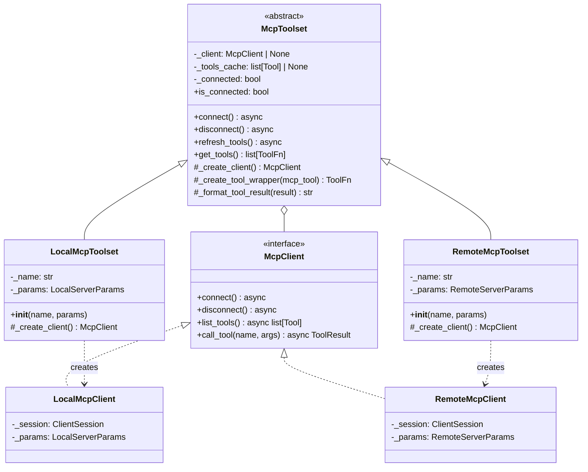
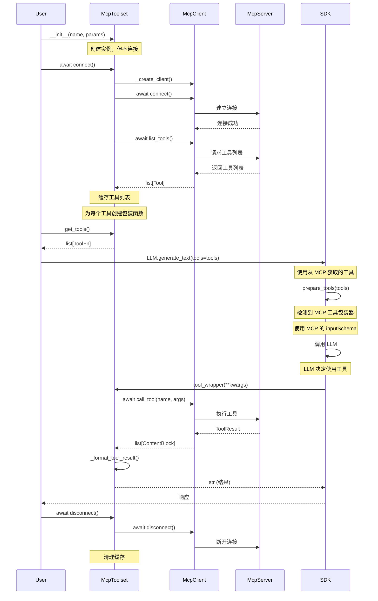
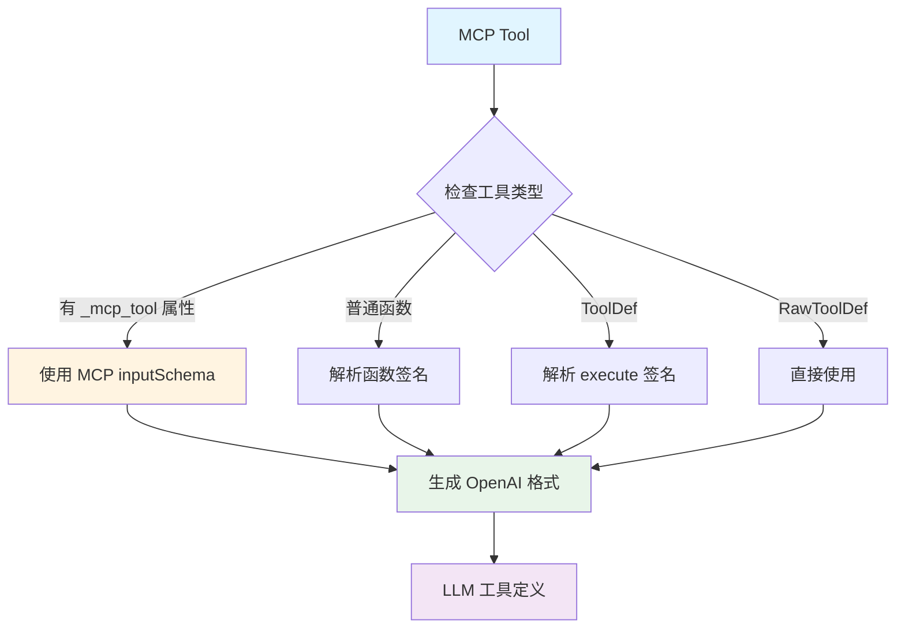
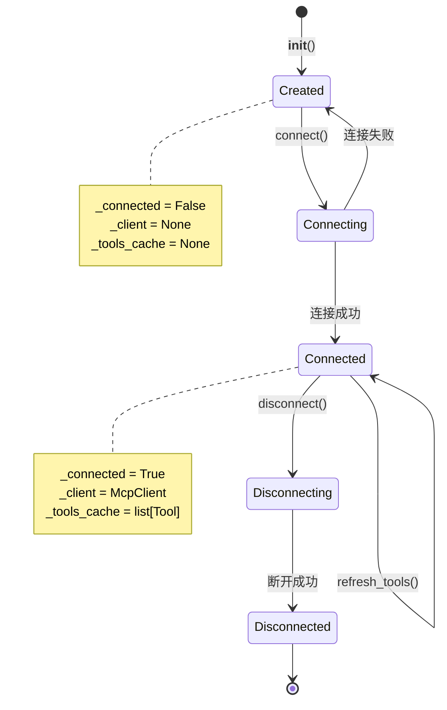
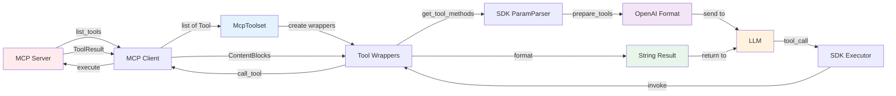
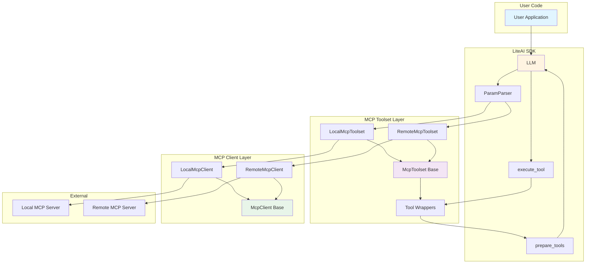
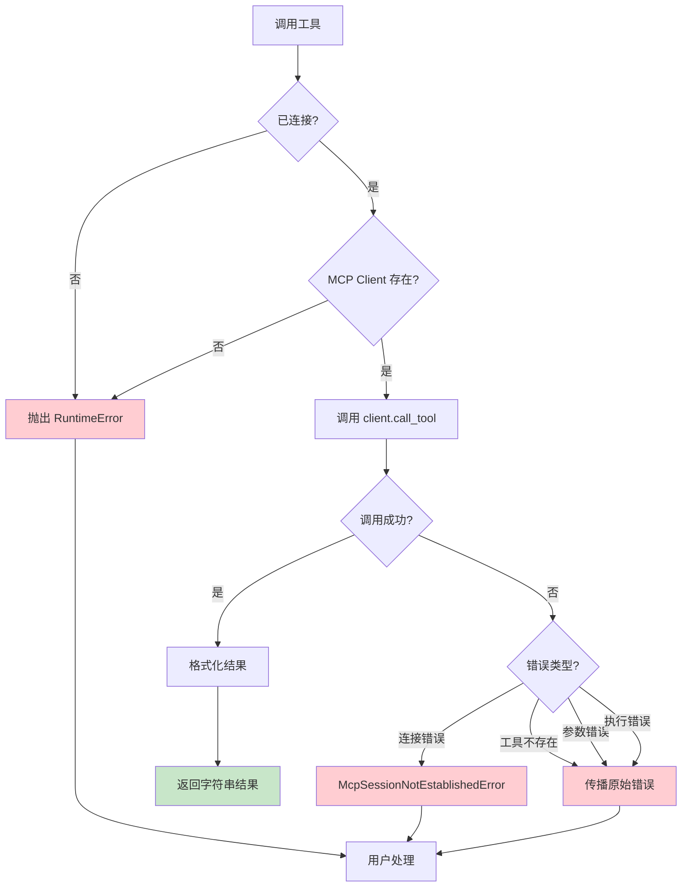

# MCP Toolset 架构图

## 类结构图



## 工作流程图



## 工具转换流程



## 生命周期状态机



## 数据流图



## 组件交互图



## 错误处理流程



## 关键设计模式

### 1. 策略模式 (Strategy Pattern)
- `McpToolset` 定义接口
- `LocalMcpToolset` 和 `RemoteMcpToolset` 提供不同的客户端创建策略

### 2. 工厂方法模式 (Factory Method Pattern)
- `_create_client()` 抽象方法
- 子类决定创建哪种类型的客户端

### 3. 代理模式 (Proxy Pattern)
- 工具包装函数作为 MCP 工具的代理
- 延迟加载和缓存工具列表

### 4. 适配器模式 (Adapter Pattern)
- 将 MCP 工具适配为 SDK 工具系统
- 转换输入/输出格式

```mermaid
graph LR
    A[MCP Tool Format] --> B[McpToolset Adapter]
    B --> C[SDK Tool Format]
    
    D[MCP ToolResult] --> E[_format_tool_result]
    E --> F[String Result]
    
    style B fill:#fff4e1
    style E fill:#fff4e1